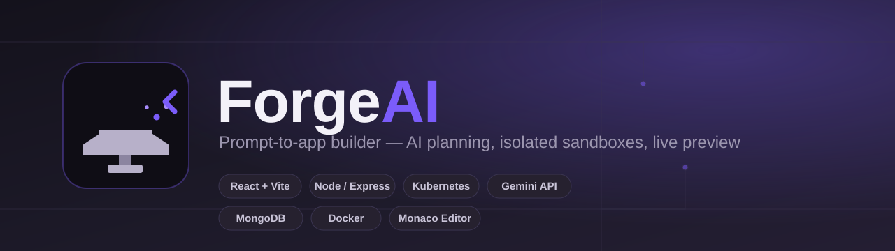
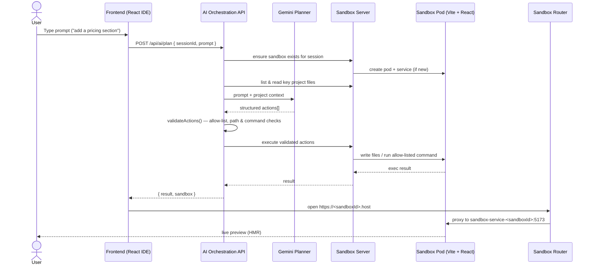
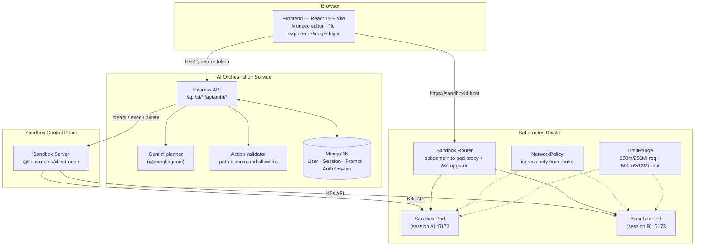
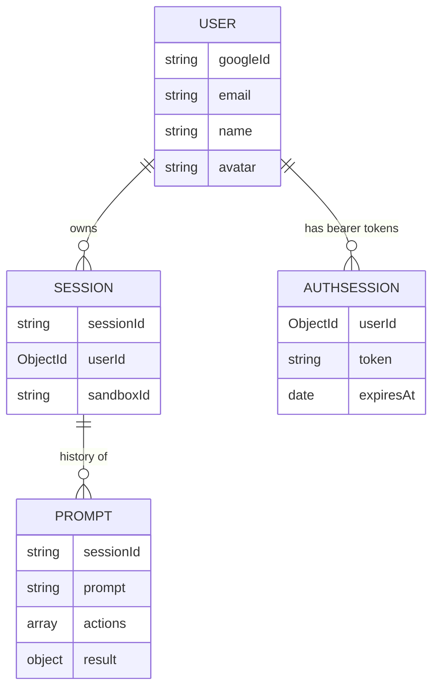

<div align="center">



<br/>

<h3>Describe an app in plain English. Watch it get built, live, in your browser.</h3>

<p>
ForgeAI is a prompt-to-app builder. You chat with an AI planner, it turns your
request into a validated sequence of file/command actions, and those actions
run inside an isolated, per-session <b>Kubernetes sandbox</b> — a real pod
running a live Vite + React dev server you can preview instantly through a
subdomain proxy.
</p>

<p>
  
  
  
  
  
  
  
</p>

<p>
  <a href="#how-it-works">How it works</a> •
  <a href="#architecture">Architecture</a> •
  <a href="#security--isolation-model">Security</a> •
  <a href="#getting-started">Getting started</a> •
  <a href="#api-reference">API reference</a>
</p>

</div>

---

## Overview

Most "AI app builder" clones stop at generating code. ForgeAI actually **runs**
it: every prompt is turned into a plan, the plan is validated against a strict
allow-list, and the approved actions execute inside a short-lived,
network-isolated Kubernetes pod dedicated to that session — with a live
preview URL served back to the browser in seconds.

**Highlights**

- 🧠 **LLM planning, not raw code-gen** — Gemini receives the current project's
  file tree + key source files as context and returns *structured actions*
  (`create_file`, `update_file`, `delete_file`, `run_command`), not a diff blob.
- 🔒 **Defense-in-depth sandboxing** — every action is schema-validated,
  path-traversal-checked, and command-allow-listed *before* it reaches a pod;
  the pod itself is CPU/memory-capped, denies its own service-account token,
  and only accepts traffic from the internal router.
- ⚡ **Live preview, zero config** — each sandbox gets its own Kubernetes
  Service; a subdomain-aware reverse proxy routes `https://<sandboxId>.host`
  straight to that pod's Vite dev server (with HMR/WebSocket support).
- ⏱️ **Self-cleaning infrastructure** — sandboxes are labeled with a TTL and
  swept by a cleanup job, so abandoned sessions don't leak cluster resources.
- 🔑 **Google-only auth** — no password storage; sessions are opaque,
  expiring, DB-backed tokens (Mongo TTL index), not client-trusted JWTs.
- 🖥️ **Full browser IDE** — Monaco-powered code editor and file explorer next
  to the chat panel, so generated code is inspectable and editable.

## How it works



## Architecture



## Security & isolation model

This is the part most "AI code generator" toy projects skip — ForgeAI treats
LLM output as **untrusted input** at every hop:

| Layer | Protection |
|---|---|
| Action schema | Only 4 actions exist (`create_file`, `update_file`, `delete_file`, `run_command`); anything else is rejected, and a plan is capped at 50 actions |
| Path safety | File paths are rejected if absolute, containing `..`, or containing backslashes — no escaping the project root |
| Command allow-list | Only `npm`, `mkdir`, `ls`, `cat`, `pwd` may run at all; shell operators (`&& \| ; > < \`` `$(...)`) are hard-blocked, and `npm` is further limited to `install`/`run` with a checked script name |
| Auth | Google Sign-In only; server issues an opaque, random session token stored in Mongo with a TTL index — no client-side-verifiable JWT to tamper with |
| Rate limiting | `/api/ai/plan` is limited per user (10 req/min) to bound LLM + sandbox spend |
| Pod hardening | `automountServiceAccountToken: false` — a compromised sandbox can't talk to the Kubernetes API |
| Resource caps | Every sandbox pod is capped at 500m CPU / 512Mi memory via pod spec **and** a cluster-wide `LimitRange` |
| Network isolation | A `NetworkPolicy` allows ingress to sandbox pods **only** from the router pod — sandboxes can't be reached directly or talk to each other |
| Lifecycle | Pods are labeled with an `expiresAt` timestamp (30 min); a cleanup job sweeps expired pods and their Services on a schedule |

## Tech stack

| Layer | Stack |
|---|---|
| Frontend | React 19, Vite, React Router, Monaco Editor |
| AI Orchestration | Node.js, Express 5, `@google/genai` (Gemini), Mongoose, Zod, `express-rate-limit` |
| Sandbox control plane | Node.js, Express, `@kubernetes/client-node` |
| Sandbox runtime | Vite + React template container, one Pod + Service per session |
| Routing | Express + `http-proxy-middleware`, subdomain to pod proxy, WebSocket upgrade for HMR |
| Data | MongoDB — `User`, `Session`, `Prompt`, `AuthSession` collections |
| Auth | Google Sign-In (`google-auth-library`), DB-backed bearer sessions |
| Infra | Docker, Kubernetes manifests (`/k8s`), Skaffold for the dev loop |

## Project structure

```
ForgeAI/
├── frontend/                    # React + Vite IDE
│   └── src/
│       ├── pages/                # Login, Workspace
│       ├── components/           # CodeEditor, FileExplorer, Logo, ProtectedRoute
│       ├── context/               # AuthContext
│       └── services/              # API client
├── ai-orchestration/             # Planner API
│   └── src/
│       ├── services/               # llmplanner, sandboxClient, authService, googleAuth, actionValidator
│       ├── models/                 # User, Session, Prompt, AuthSession
│       ├── middleware/             # authMiddleware
│       └── config/                 # db.js
├── sandbox/
│   ├── server/                   # Kubernetes control plane (create/exec/delete pods)
│   │   └── src/kubernetes/         # pod.js, service.js, delete.js, cleanup.js, config.js
│   ├── router/                   # Subdomain-based reverse proxy to live pods
│   └── template/                 # Base Vite + React project cloned into every sandbox
└── k8s/                          # Deployments, Services, Ingress, NetworkPolicy, LimitRange
```

## Data model



## Getting started

### Prerequisites

- Node.js 18+
- A MongoDB instance (local or Atlas)
- A Kubernetes cluster with `kubectl` context configured (Minikube/Kind
  locally, or a managed cluster) — the sandbox server provisions real pods,
  so this is required even for local development of the sandbox flow
- A [Google Gemini API key](https://ai.google.dev/)
- A [Google OAuth client ID](https://console.cloud.google.com/apis/credentials)

### 1. Clone and install

```bash
git clone https://github.com/<your-username>/ForgeAI.git
cd ForgeAI

cd ai-orchestration && npm install && cd ..
cd sandbox/server && npm install && cd ../..
cd sandbox/router && npm install && cd ../..
cd frontend && npm install && cd ..
```

### 2. Configure environment variables

**`ai-orchestration/.env`**
```env
MONGO_URI=mongodb://localhost:27017/forgeai
GEMINI_API_KEY=your_gemini_api_key
GOOGLE_CLIENT_ID=your_google_oauth_client_id
SANDBOX_SERVER_URL=http://localhost:3001
```

**`frontend/.env`**
```env
VITE_API_URL=http://localhost:4000
VITE_SANDBOX_URL=http://localhost:3001
VITE_GOOGLE_CLIENT_ID=your_google_oauth_client_id
```

### 3. Build the sandbox template image

The sandbox server schedules pods from a prebuilt image (`sandbox-template:v1`).
Build and load it into your cluster first:

```bash
cd sandbox/template
docker build -t sandbox-template:v1 .
# Minikube: minikube image load sandbox-template:v1
# Kind:     kind load docker-image sandbox-template:v1
```

### 4. Run each service

```bash
# AI orchestration API — :4000
cd ai-orchestration && npm run dev

# Sandbox control server — :3001 (needs a valid kubeconfig)
cd sandbox/server && npm run dev

# Sandbox router — :3000
cd sandbox/router && npm run dev

# Frontend — :5173
cd frontend && npm run dev
```

### 5. (Optional) Deploy to Kubernetes

Manifests for every component — orchestration service, sandbox server/router,
ingress, `LimitRange`, and `NetworkPolicy` — live in [`/k8s`](./k8s).

```bash
kubectl apply -f k8s/
```

## API reference

All `/api/ai/*` and `/api/auth/me` / `/api/auth/logout` routes require
`Authorization: Bearer <token>`.

| Method | Route | Description |
|---|---|---|
| `POST` | `/api/auth/google` | Exchange a Google credential for a session token |
| `GET` | `/api/auth/me` | Get the current authenticated user |
| `POST` | `/api/auth/logout` | Invalidate the current session token |
| `POST` | `/api/ai/plan` | Send a prompt for a session; plans, validates, and executes actions against its sandbox |
| `GET` | `/api/ai/sessions/:sessionId/history` | Get the prompt/action history for a session |
| `DELETE` | `/api/ai/sessions/:sessionId` | Delete a session and tear down its sandbox |
| `POST` | `/api/ai/sessions/:sessionId/sandbox` | Ensure a sandbox exists for a session and return its preview URL |
| `GET` | `/api/ai/health` | Health check |


## Author

Built by **Hari** ([@hari5827](https://github.com/hari5827)) — portfolio at
[hariom-mishra.vercel.app](https://hariom-mishra.vercel.app).

## License

Licensed under the [MIT License](./LICENSE).
